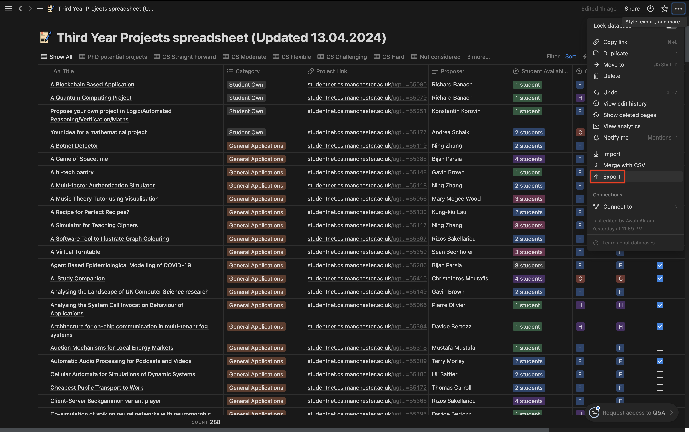
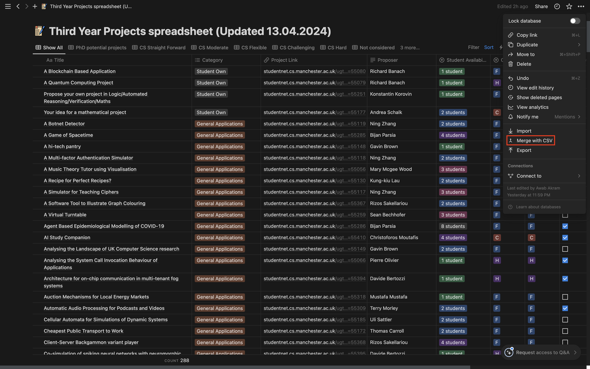

# UOM-Project-Scraper

# Updating your notion projects database 
## 1. Export your existing notion database to csv file
Open up your notion database and select the export option

Fill in these settings and then click export

This will allow you to download a zip file with the csv file in it. Save the zip file anywhere and copy the csv file into this project's directory.

## 2. Formatting csv file into the correct format
Run the format file on the downloaded csv file using `python3 format.py "<File name>"` 

where the \<File name\> should be replaced with the csv file you got from exporting your notion database

This will write a new file "formatted.csv"

## 3. Run the the scraper script
To use script.py, first update the USERNAME and PASSWORD values in the code to your own personal username and password (the one you use to log into blackboard and all other university services).
Then run the file using `python3 script.py`

This will scrape all projects from the project website and write them to csv file "output.csv"

## 4. Run the changes script to see what projects are new

Run the file using `python3 format.py "<Old File name>" "<New File name>"`

where the \<Old File name\> should be replaced with the csv file with all the old projects you have already, and the \<New File name\> should be replaced with the csv file with all the projects currently available

So the command will probably look like `python3 format.py "formatted.csv" "output.csv"`

All the new projects will be written to the file "changes.csv" - at this point it is recomended to check changes.csv to see if everything looks good.

## 5. Merge the new projects into your notion database
Open up your notion database and select the 'Merge with CSV' option

Select your changes.csv file

# Extras

## Different Files
script.py - scrapes all projects from the project website and writes them to csv file "output.csv"

format.py - converts notion outputted csv file into the same format as files outputted by script.py, outputted to "formatted.csv"

changes.py - finds all the new projects between 2 files and writes them to csv file "changes.csv"

### script.py
#### Pre-requesites
Must first have chrome installed (Could probably use other browsers by changing the code, feel free to experiment)
PIP packages required: bs4, selenium

#### Usage
To use script.py, first update the USERNAME and PASSWORD values in the code to your own personal username and password (the one you use to log into blackboard and all other university services).
Then run the file using `python3 script.py`

### format.py 
Run the file using `python3 format.py "<File name>"` 

where the \<File name\> should be replaced with the csv file you got from exporting your notion database

### changes.py
Run the file using `python3 format.py "<Old File name>" "<New File name>"`

where the \<Old File name\> should be replaced with the csv file with all the old projects you have already, and the \<New File name\> should be replaced with the csv file with all the projects currently available

## Extra Notes
This project was initially created in 2024, for any future years you may be able to get away with just changing the URL that script.py scrapes from to accomodate the new year, but that is given that the overall format of the website stays the same.